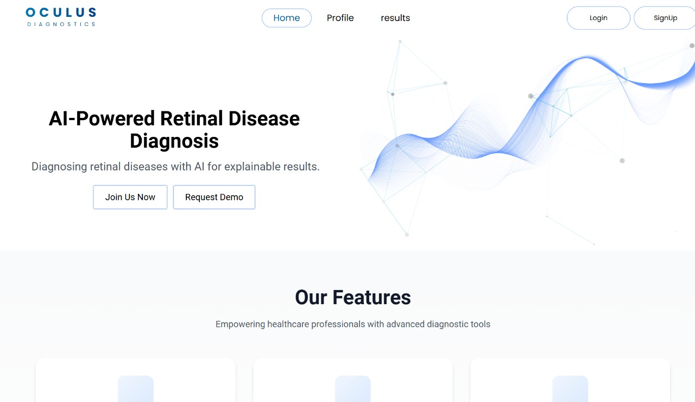
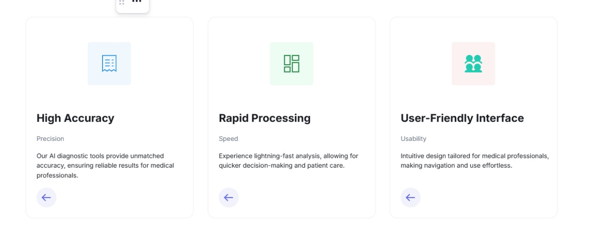
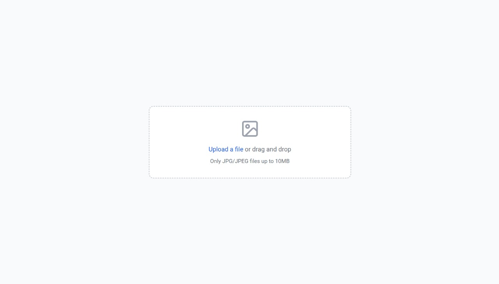
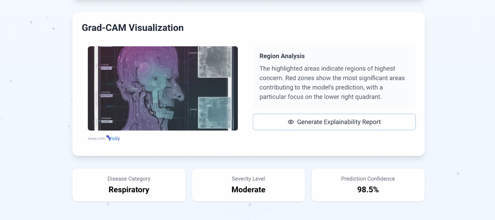
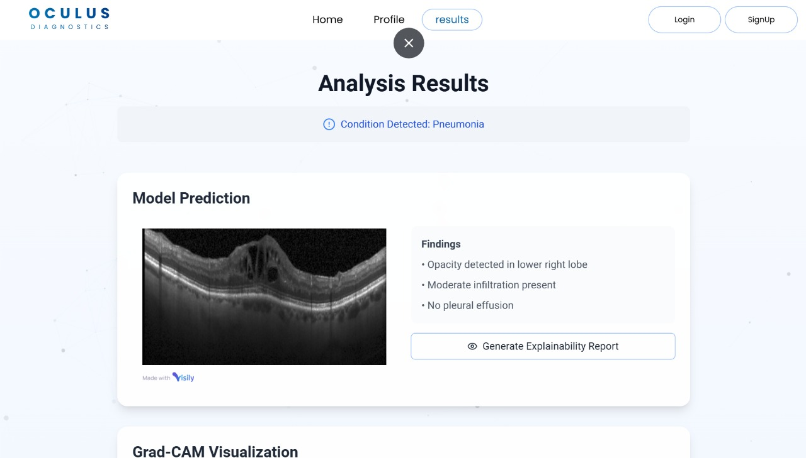

# Explainable AI for Retinal Disease Diagnosis

This repository contains code for training and deploying a deep learning model for retinal disease diagnosis using OCT images. The model is based on EfficientNetB7 and trained on a TFRecord dataset.

## Features

- Multi-GPU training using TensorFlow's `MirroredStrategy`.
- Pre-trained EfficientNetB7 as the base model.
- Checkpointing to save the best-performing model.

## Directory Structure

- `training.ipynb`: Code for training the model.
- `pre-processing.ipynb`: Dataset preprocessing utilities.
- `app.py`: script for deploying the trained model.
- `xai-front-end-prototype/`: Frontend code in React for user interaction.

## Frontend

The frontend for the project is developed using React. The application provides an intuitive interface for users to interact with the model's functionality, such as uploading OCT images and viewing diagnostic results. The frontend is hosted in the `xai-front-end-prototype` folder on GitHub.

### Screenshots of the Frontend:

1. **Main Home Page**  
   

2. **Features Home Page**  
   

3. **Upload Image Screen**  
   

4. **Grad-CAM Results Display**  
   

5. **Diagnostics Results Screen**  
   

## Prototype-XAI for Retinal Disease Diagnosis

A detailed prototype for the "Explainable AI for Retinal Disease Diagnosis" project has been designed and can be accessed on Visily. The interface showcases the user journey, including image uploads, results display, and explainable AI features.

[Prototype-XAI](https://app.visily.ai/projects/ef8f771b-a013-4d28-b5e5-a95c882af6e4/boards/1493524)


## Setup

1. Clone the repository:

    ```bash
    git clone https://github.com/msafee72/Explainable-AI_for_Retinal_Disease_Diagnosis.git
    cd Explainable-AI_for_Retinal_Disease_Diagnosis
    ```

2. Install dependencies:

    ```bash
    pip install -r requirements.txt
    ```

3. Prepare your dataset in TFRecord format.

## Training

To train the model, use the script in `training.ipynb`. The dataset should be stored in the specified TFRecord format.

## Group Members (FYDP-OC-2024-SE-11-XAI)

- **Muhammad Safee** (BSEF21M057)
- **Muhammad Muaz Saleem** (BSEF21M036)
- **Muhammad Usman** (BSEF21M046)
- **Muhammad Naseem** (BSEF21M058)
